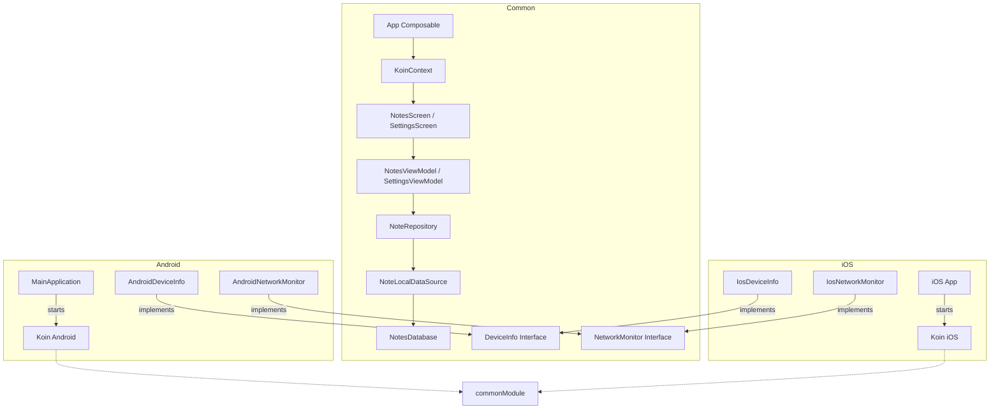

# MyNotes - Kotlin Multiplatform (Upgraded with Platform Features)

## Architecture Diagram



## Fitur Baru (Tugas 8)

### 1. Koin Dependency Injection
Seluruh dependensi aplikasi sekarang dikelola menggunakan Koin untuk meningkatkan skalabilitas dan kemudahan pengujian.
- **Modules**: Pemisahan antara `commonModule` (logic bisnis) dan `platformModule` (native implementation).
- **DSL**: Menggunakan `singleOf`, `viewModelOf`, dan `factory` untuk definisi dependensi yang ringkas.

### 2. Expect/Actual Pattern
Implementasi fitur native secara clean tanpa membocorkan detail platform ke layer common:
- **DeviceInfo**: Mendapatkan informasi model, versi OS, dan manufaktur perangkat secara native.
- **NetworkMonitor**: Memantau status koneksi internet secara real-time menggunakan API native (`ConnectivityManager` di Android).

### 3. UI Integration & Interaction
- **Network Indicator**: Ikon cloud di TopBar yang berubah warna (Hijau/Merah) secara reaktif mengikuti status internet.
- **Pull to Refresh**: Fitur modern untuk menyegarkan daftar catatan dengan gestur tarik ke bawah.
- **Advanced Edit Mode**: Kemampuan mengedit Judul dan Isi catatan sekaligus memperbarui waktu edit secara otomatis sehingga catatan terbaru selalu di atas.

---

## Penerapan Kode

### 1. Koin Dependency Injection
Konfigurasi module dilakukan di layer *CommonMain* dan diinjeksi ke UI menggunakan `koinViewModel()`.

**Common Module (`Modules.kt`):**
```kotlin
val commonModule = module {
    single { NotesDatabase(get()) }
    singleOf(::NoteLocalDataSource)
    singleOf(::NoteRepository)
    
    viewModelOf(::NotesViewModel)
    viewModelOf(::SettingsViewModel)
}
```

### 2. Expect/Actual Pattern
Digunakan untuk mengakses fungsionalitas hardware native Android dan iOS dari kode Common.

**Common Declaration (`DeviceInfo.kt`):**
```kotlin
expect fun getDeviceInfo(): DeviceInfo
```

**Android Implementation (`DeviceInfo.android.kt`):**
```kotlin
actual fun getDeviceInfo(): DeviceInfo = AndroidDeviceInfo()
```

### 3. UI Integration (Reaktif)
Menggunakan library `koin-compose` untuk menyambungkan dependensi platform ke dalam UI.

**Injeksi di `NotesScreen.kt`:**
```kotlin
@Composable
fun NotesScreen(
    viewModel: NotesViewModel = koinViewModel() 
) {
    val networkMonitor: NetworkMonitor = koinInject()
    val isConnected by networkMonitor.isConnected.collectAsState(initial = true)
    
    // UI reaktif terhadap status isConnected
}
```

---

## Screenshot

### Device Info (Settings Screen)


### Network Status Indicator (Data On)


### Network Status Indicator (Data Off)


### Vidio Demo
https://github.com/user-attachments/assets/fa90c857-d80c-4250-b820-20f4854e8cc3


---


